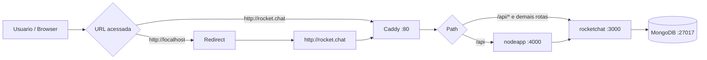
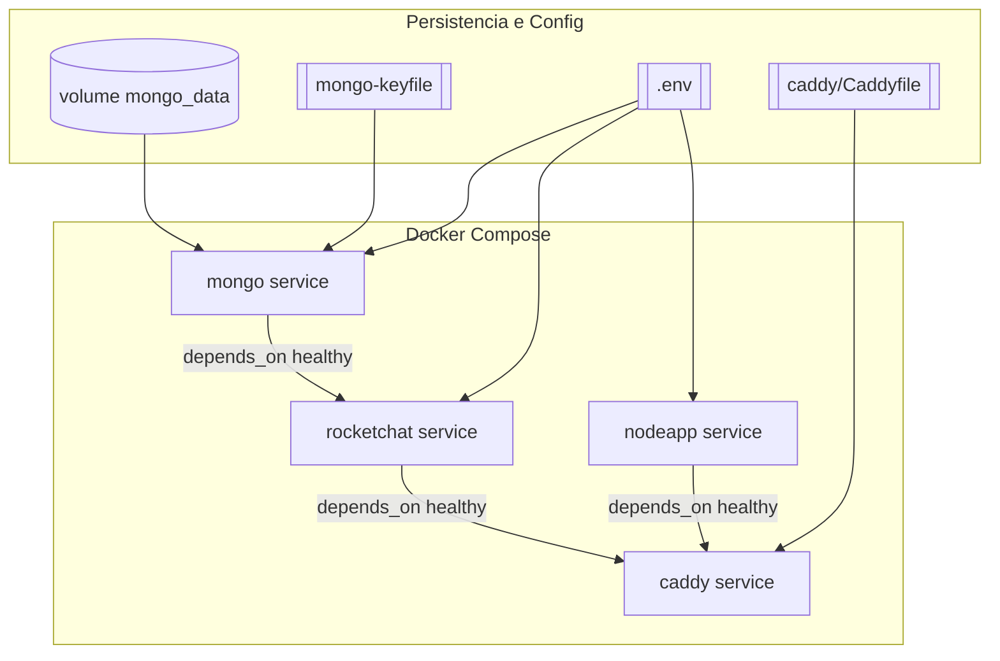

# Arquitetura do Projeto

## Visao geral
O projeto roda uma stack Docker Compose com 4 servicos:

- `mongo`: banco NoSQL com replica set `rs0`.
- `rocketchat`: aplicacao principal de chat.
- `nodeapp`: API Node.js (rota `/api`).
- `caddy`: proxy reverso na porta `80`.

## Fluxo de requisicao
O acesso externo acontece por `http://rocket.chat` (ou `http://localhost` redirecionado):

1. Cliente acessa `caddy:80`.
2. Caddy encaminha:
   - `/api` para `nodeapp:4000`.
   - demais rotas para `rocketchat:3000`.
3. Rocket.Chat persiste dados no Mongo (`mongo:27017`), usando autenticacao e replica set.

## Banco de dados (Mongo)

- O Mongo sobe com:
  - `--replSet rs0`
  - `--keyFile /etc/mongo-keyfile`
- O script `ativar_servidores.sh`:
  - garante `mongo-keyfile` valido (`400`, owner compativel),
  - espera o Mongo ficar healthy,
  - inicializa/valida o replica set `rs0`.

As URLs usadas pelo Rocket.Chat incluem replica set:

- `MONGO_URL=.../rocketchat?...&replicaSet=rs0`
- `MONGO_OPLOG_URL=.../local?...&replicaSet=rs0`

## Ordem de subida (startup)
Para evitar falhas intermitentes:

1. Sobe `mongo` e `nodeapp`.
2. Aguarda `mongo` healthy.
3. Inicializa e valida `rs0`.
4. Sobe `rocketchat`.
5. Aguarda health do Rocket.Chat.
6. Sobe `caddy` por ultimo.

## Healthchecks

- `mongo`: `ping` autenticado no banco.
- `nodeapp`: requisição HTTP local na porta `4000`.
- `rocketchat`: requisição HTTP local na porta `3000`.

Isso reduz falso positivo de "container up, app indisponivel".

## Compatibilidade entre maquinas
O projeto possui fallback automatico para ambientes diferentes:

- cria `.env` se estiver ausente;
- ajusta `/etc/hosts` para `rocket.chat`;
- usa `sudo docker` automaticamente quando necessario;
- detecta CPU sem AVX e troca para imagens legadas:
  - `MONGO_IMAGE=mongo:4.4.29`
  - `ROCKETCHAT_IMAGE=rocketchat/rocket.chat:4.8.7`

## Resumo visual

```text
Cliente
  |
  v
Caddy (:80)
  |-- /api  ----------> nodeapp (:4000)
  |-- demais rotas ---> rocketchat (:3000)
                           |
                           v
                        mongo (:27017, rs0)
```

## Fluxo Mermaid (Requisicoes)



## Fluxo Mermaid (Startup e Recuperacao)

```mermaid
flowchart TD
  A[Iniciar bash ativar_servidores.sh] --> B[Validar acesso Docker\n(docker ou sudo docker)]
  B --> C[Garantir .env\n(ou criar automatico)]
  C --> D{CPU com AVX?}
  D -->|Sim| E[Manter imagens padrao]
  D -->|Nao| F[Setar modo legado\nMONGO 4.4.29 + RC 4.8.7]
  E --> G[Garantir mongo-keyfile\narquivo + chmod 400 + owner compativel]
  F --> G
  G --> H[Garantir hosts\n127.0.0.1 rocket.chat]
  H --> I[Subir mongo + nodeapp]
  I --> J[Aguardar mongo healthy]
  J --> K[Inicializar/validar rs0]
  K --> L[Subir rocketchat]
  L --> M[Aguardar health geral\nmongo+nodeapp+rocketchat]
  M -->|OK| N[Subir caddy]
  N --> O[Status final + URLs]

  M -->|Falha| P[Recuperacao automatica:\ndocker compose down -v]
  P --> Q[Reaplicar keyfile]
  Q --> I
```

## Fluxo Mermaid (Dependencias Compose)


